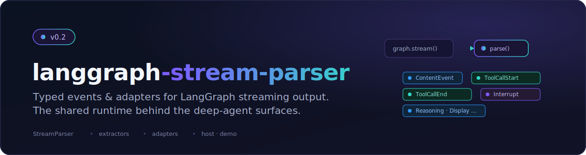

<p align="center">
  
</p>

# langstage-core

The shared core behind the **[LangStage](https://github.com/dkedar7/langstage) family**: a host layer for LangGraph agents (spec-loading + layered config), an in-process **AG-UI** bridge that streams any `CompiledGraph` to a frontend, an async task-delegation engine, and interrupt-aware input helpers. Write your agent once — any LangGraph `CompiledGraph` — and every LangStage surface runs it the same way.

> **1.0 — renamed from `langgraph-stream-parser`.** The old `StreamParser` / `events` / `event_to_dict` event layer was retired in favor of the AG-UI wire (see [Migrating](#migrating-from-langgraph-stream-parser) and [ADR 0003](docs/adr/0003-deprecate-the-event-layer.md)). The old `import langgraph_stream_parser` keeps working **as long as the separate `langgraph-stream-parser` compat package stays installed** (it re-exports `langstage_core`); a fresh install of `langstage-core` alone does not provide it.

## Every stage for your LangGraph agent

`langstage-core` is the shared core of the **LangStage family**: write your agent once — any LangGraph `CompiledGraph` — and run it on every stage with the same spec string (`module:attr` or `path/to/file.py:attr`), the same `langstage.toml` config file, and the same `LANGSTAGE_*` environment variables. (The pre-rename `deepagents.toml` / `DEEPAGENT_*` vocabulary still resolves as a deprecated fallback.)

| Stage | Package | Try it |
|---|---|---|
| Web app | [langstage](https://github.com/dkedar7/langstage) | `langstage run --agent my_agent.py:graph` |
| JupyterLab | [langstage-jupyter](https://github.com/dkedar7/langstage-jupyter) | `pip install langstage-jupyter`, then the chat sidebar in `jupyter lab` |
| Terminal | [langstage-cli](https://github.com/dkedar7/langstage-cli) | `langstage-cli -a my_agent.py:graph` |
| VS Code | [langstage-vscode](https://github.com/dkedar7/langstage-vscode) | chat participant + stdio sidecar |
| Reference agent | [langstage-hermes](https://github.com/dkedar7/langstage-hermes) | `LANGSTAGE_AGENT_SPEC=langstage_hermes.agent:graph` on any stage |
| Shared core | langstage-core | **you are here** |

📖 **Full documentation:** <https://dkedar7.github.io/langstage-docs/>

## Installation

```bash
pip install "langstage-core[agui]"
```

The `[agui]` extra pulls the AG-UI runtime (`ag-ui-langgraph[fastapi]` + `uvicorn`) — needed for the streaming bridge below and by every LangStage surface. The bare `pip install langstage-core` (only `langchain-core`) is enough if you just want the host/config/tasks layer without streaming.

No agent of your own yet? The `[stub]` extra adds a keyless echo graph you can stream:

```bash
pip install "langstage-core[agui,stub]"
```

## Quick start

Wrap any compiled graph with `build_agent`, then stream a turn. Two shared mappings cover the two frontend styles the family uses:

```python
import asyncio
from langstage_core import load_agent_spec
from langstage_core.agui import build_agent, iter_event_frames

# any LangGraph CompiledGraph — here the keyless demo stub
agent = build_agent(load_agent_spec("langstage_core.demo.stub:graph"))

async def main():
    async for frame in iter_event_frames(agent, "hello", thread_id="s1"):
        if frame["type"] == "content":
            print(frame["content"], end="")
        elif frame["type"] == "complete":
            print()

asyncio.run(main())
```

- **`iter_event_frames`** yields rich, typed frames — `content`, `tool_start`, `tool_end`, `reasoning`, `interrupt`, `extraction`, `complete`, `error` — used by the web and VS Code surfaces.
- **`iter_chunk_frames`** yields terminal-friendly chunk dicts — `{"status": "streaming", "chunk": "..."}` … `{"status": "complete"}` — used by the CLI and Jupyter surfaces.

`build_agent` attaches an in-memory checkpointer if the graph has none, so multi-turn memory and interrupts work out of the box; pass a `thread_id` per turn to key per-conversation state.

### Human-in-the-loop (interrupt → resume)

When the graph calls `interrupt(...)`, you get an `interrupt` frame; resume by passing the decision back via `resume=`:

```python
async for frame in iter_event_frames(agent, "run it", thread_id="s1"):
    if frame["type"] == "interrupt":
        # frame["action_requests"], frame["allowed_decisions"]
        ...

# next turn resumes the same thread with the user's decision
async for frame in iter_event_frames(agent, "", thread_id="s1",
                                     resume={"decisions": [{"type": "approve"}]}):
    ...
```

Decision types: `approve`, `reject`, `edit`, `respond` (deepagents 0.6+ / LangGraph 1.1+).

## What's in the box

Everything is re-exported from the top-level `langstage_core` package (except the AG-UI helpers under `langstage_core.agui`):

| Area | API | What it does |
|---|---|---|
| **Host** | `load_agent_spec`, `HostConfig`, `Workspace` | Load a graph from a `module:attr` / `file.py:attr` spec; resolve layered config (defaults < `langstage.toml` < `LANGSTAGE_*` env < overrides). |
| **AG-UI bridge** (`langstage_core.agui`) | `build_agent`, `iter_event_frames`, `iter_chunk_frames`, `build_app`, `serve`, `add_agui_endpoint` | Stream any `CompiledGraph` in-process (the `iter_*` mappings) or serve it as an AG-UI HTTP endpoint. |
| **Session adapter** (top-level; also `langstage_core.adapters`) | `SessionAdapter`, `Session` | A session-scoped driver over the AG-UI agent with a typed terminal `outcome` — the streaming engine behind the web app + task board. |
| **Input helpers** | `prepare_agent_input`, `create_resume_input` | Build graph input from a message (+ optional context) or a resume decision. |
| **Extractors** | `ToolExtractor` + built-ins (`ThinkToolExtractor`, `TodoExtractor`, `DisplayInlineExtractor`, `SkillManageExtractor`, `MemoryExtractor`, …) | Turn a tool's result into a structured `extraction` frame; pass `extractors=[...]` to the `iter_*` mappings. |
| **Task engine** | `TaskRunner`, `TaskStore`, `InMemoryTaskStore`, `TASK_TOOLS`, `set_runner`, `get_runner` | Async delegate-and-walk-away worker pool + a persistence-agnostic store Protocol; `TASK_TOOLS` are the agent-facing delegation tools. |

## Serve any agent over AG-UI

Any LangGraph agent can be served over the **[AG-UI protocol](https://github.com/ag-ui-protocol/ag-ui)** — the event-based wire for streaming rich agent interactions (text, tool calls, reasoning, state, interrupts) to frontends (CopilotKit, React/Vue/Angular components, any AG-UI client). The host layer resolves *which* agent; the official MIT `ag-ui-langgraph` adapter owns the wire:

```bash
langstage-agui --agent my_agent.py:graph     # serve over AG-UI at http://localhost:8050
langstage-agui --demo                          # keyless echo agent, no API key
langstage-agui --agent my_agent.py:graph --verify   # run one keyless turn; exit 0 ok / 1 failed
```

`--verify` is the preflight to run right after wiring up an agent: `--show-config` proves the config chain *resolves* a spec, but `--verify` proves it **loads and actually produces a turn** — catching the two most common failures (a typo'd `module:attr`, or a graph that loads but yields an empty/erroring turn) that otherwise only surface at first chat. Keyless, so it fits a CI/deploy gate.

```python
from langstage_core.agui import build_app
app = build_app(my_compiled_graph)   # an ASGI (FastAPI) app; run with uvicorn
```

See [ADR 0001](docs/adr/0001-adopt-ag-ui-for-the-wire.md) for the rationale.

## Configuration

The same resolution chain everywhere — defaults < `langstage.toml` < `LANGSTAGE_*` env < CLI/overrides (legacy `deepagents.toml` / `DEEPAGENT_*` still resolve as a deprecated fallback). Print the resolved value + source of every key:

```bash
python -m langstage_core.host      # or each surface's --show-config
```

## Migrating from langgraph-stream-parser

`langstage-core` **1.0** is the rename of `langgraph-stream-parser`. The old import name keeps working **through a separate compat package** — `langgraph-stream-parser` 1.0, which now just re-exports `langstage_core` (with a `DeprecationWarning`). So `import langgraph_stream_parser` and its submodules keep resolving **only while that package remains installed**:

- **Upgrading in place** (`pip install -U langgraph-stream-parser`) → you keep the shim package, so the old import keeps working. Update to `import langstage_core` when convenient.
- **Installing `langstage-core` fresh** does **not** pull the shim (it's a separate distribution, and depending on it would be circular). Either `import langstage_core` (recommended), or `pip install langgraph-stream-parser` alongside if you need the old name during a transition.

The **event layer was removed** in 1.0. If you used it directly, migrate:

| Removed (pre-1.0) | Use instead |
|---|---|
| `StreamParser`, `langstage_core.events`, `event_to_dict` | `langstage_core.agui.iter_event_frames` / `iter_chunk_frames` (frame dicts, same vocabulary) |
| `stream_graph_updates`, `resume_graph_from_interrupt` | `iter_chunk_frames(agent, msg, thread_id, resume=...)` |
| `adapters.CLIAdapter` / `PrintAdapter` / `FastAPIAdapter` / `JupyterDisplay` | `SessionAdapter` (in-process) or `build_app` / `serve` (HTTP), both AG-UI |

Kept and unchanged: `load_agent_spec`, `HostConfig`, `prepare_agent_input`, `create_resume_input`, the `tasks` engine, and the `extractors` (`ToolExtractor` + built-ins). Full detail: [ADR 0003](docs/adr/0003-deprecate-the-event-layer.md).

## Development

```bash
pip install -e ".[dev]"
pytest
pytest --cov=langstage_core
```

## License

MIT
