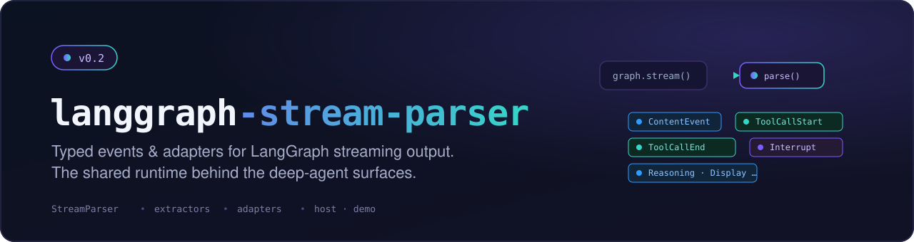

<p align="center">
  
</p>

# langstage-core

The shared core behind the **[LangStage](https://github.com/dkedar7/langstage) family**: a host layer for LangGraph agents (spec-loading + layered config), an in-process **AG-UI** bridge that streams any `CompiledGraph` to a frontend, an async task-delegation engine, and interrupt-aware input helpers. Write your agent once — any LangGraph `CompiledGraph` — and every LangStage surface runs it the same way.

> **1.0 — renamed from `langgraph-stream-parser`.** The old `StreamParser` / `events` / `event_to_dict` event layer was retired in favor of the AG-UI wire (see [Migrating](#migrating-from-langgraph-stream-parser) and [ADR 0003](docs/adr/0003-deprecate-the-event-layer.md)). The old `import langgraph_stream_parser` keeps working **as long as the separate `langgraph-stream-parser` compat package stays installed** (it re-exports `langstage_core`); a fresh install of `langstage-core` alone does not provide it.

## Every stage for your LangGraph agent

`langstage-core` is the shared core of the **LangStage family**: write your agent once — any LangGraph `CompiledGraph` — and run it on every stage with the same spec string (`module:attr` or `path/to/file.py:attr`), the same `langstage.toml` config file, and the same `LANGSTAGE_*` environment variables. (The pre-rename `deepagents.toml` / `DEEPAGENT_*` vocabulary still resolves as a deprecated fallback.)

| Stage | Package | Try it |
|---|---|---|
| Web app | [langstage](https://github.com/dkedar7/langstage) | `langstage run --agent my_agent.py:graph` |
| JupyterLab | [langstage-jupyter](https://github.com/dkedar7/langstage-jupyter) | `pip install langstage-jupyter`, then the chat sidebar in `jupyter lab` |
| Terminal | [langstage-cli](https://github.com/dkedar7/langstage-cli) | `langstage-cli -a my_agent.py:graph` |
| VS Code | [langstage-vscode](https://github.com/dkedar7/langstage-vscode) | chat participant + stdio sidecar |
| Reference agent | [langstage-hermes](https://github.com/dkedar7/langstage-hermes) | `LANGSTAGE_AGENT_SPEC=langstage_hermes.agent:graph` on any stage |
| Shared core | langstage-core | **you are here** |

📖 **Full documentation:** <https://dkedar7.github.io/langstage-docs/>

## Installation

```bash
pip install "langstage-core[agui]"
```

The `[agui]` extra pulls the AG-UI runtime (`ag-ui-langgraph[fastapi]` + `uvicorn`) — needed for the streaming bridge below and by every LangStage surface. The bare `pip install langstage-core` (only `langchain-core`) covers the host/config layer only (`load_agent_spec`, `HostConfig`, the resume helpers). The task engine needs `[agui]` too: `SessionAdapter` drives every task through the AG-UI bridge, so on a bare install each task ends `failed`.

No agent of your own yet? The `[stub]` extra adds a keyless echo graph you can stream:

```bash
pip install "langstage-core[agui,stub]"
```

## Quick start

Wrap any compiled graph with `build_agent`, then stream a turn. Two shared mappings cover the two frontend styles the family uses:

```python
import asyncio
from langstage_core import load_agent_spec
from langstage_core.agui import build_agent, iter_event_frames

# any LangGraph CompiledGraph — here the keyless demo stub
agent = build_agent(load_agent_spec("langstage_core.demo.stub:graph"))

async def main():
    async for frame in iter_event_frames(agent, "hello", thread_id="s1"):
        if frame["type"] == "content":
            print(frame["content"], end="")
        elif frame["type"] == "complete":
            print()

asyncio.run(main())
```

- **`iter_event_frames`** yields rich, typed frames — `content`, `tool_start`, `tool_end`, `reasoning`, `interrupt`, `extraction`, `complete`, `error` — used by the web and VS Code surfaces.
- **`iter_chunk_frames`** yields terminal-friendly `status`-keyed chunk dicts — used by the CLI and Jupyter surfaces. A `streaming` chunk carries exactly **one** payload key (`chunk`, `reasoning`, `tool_calls`, `tool_result`, or `extraction`), so branch on the key rather than assuming `chunk`.

`build_agent` attaches an in-memory checkpointer if the graph has none (on a copy — your graph object is never mutated), so multi-turn memory and interrupts work out of the box: build the agent once, reuse it, and pass a `thread_id` per turn to key per-conversation state.

#### Frame reference

Both wires carry the same information; the table is the contract (keys marked *new* are additive and safe to ignore).

| Event wire (`iter_event_frames`) | Chunk wire (`iter_chunk_frames`) | Meaning |
|---|---|---|
| `{"type": "content", "content", "role", "node", "message_id"}` | `{"status": "streaming", "chunk", "node", "message_id"}` | Assistant text delta. `message_id` (*new*) is the AIMessage it belongs to: a change of id between two text frames is a **message boundary** (e.g. two nodes' replies) — join with a paragraph break, not inline. |
| `{"type": "reasoning", "content", "node"}` | `{"status": "streaming", "reasoning", "node"}` | Reasoning-model chain-of-thought, separate from the answer. |
| `{"type": "tool_start", "id", "name", "args", "node"}` | `{"status": "streaming", "tool_calls": [{"name", "args", "id"}]}` | A tool call (chunk `id` is *new*). |
| `{"type": "tool_end", "id", "name", "result", "status", "error_message", "duration_ms"}` | `{"status": "streaming", "tool_result", "id", "name", "tool_status", "duration_ms"}` | A tool result (capped at `max_result_len`). `status` / `tool_status` is `"success"` or `"error"`; `duration_ms` is the tool's run time, or `None` when the tool ran outside LangChain's tool runtime (e.g. a hand-written node). Chunk `id` / `name` / `tool_status` / `duration_ms` are *new*; `tool_result` is still the result string. |
| `{"type": "extraction", "tool_name", "extracted_type", "data"}` | `{"status": "streaming", "extraction": {"tool_name", "extracted_type", "data"}}` | An extractor's output for a **successful** tool result (never emitted for a failed tool). |
| `{"type": "interrupt", "action_requests", "review_configs", "allowed_decisions"}` | `{"status": "interrupt", "interrupt": {...same keys}}` | A HITL pause; resume with `resume=`. |
| `{"type": "complete", "outcome"}` | `{"status": "complete", "outcome"}` | Terminal. `outcome` (*new*) is `"interrupted"` if the turn paused on an interrupt, else `"complete"`. |
| `{"type": "error", "error"}` | `{"status": "error", "error"}` | Terminal — nothing follows it (no `complete`). Content earlier nodes already produced is emitted before it. |

Frames arrive in message order: a node that returns a *finished* `AIMessage` (no token streaming — `model.invoke()`, a router, a canned reply) is emitted when that node finishes, its text before its own tool calls, and the served AG-UI endpoint (`build_app` / `serve`) streams the same `TEXT_MESSAGE_*` / `TOOL_CALL_*` events the in-process wires are built from.

#### See every frame type, keyless

The echo stub above only emits `content`. To see the *rich* frames without an API key, point `build_agent` at the bundled tool demo (`langstage_core.demo.tools:graph`): it calls a built-in tool through a real `ToolNode`, streams a reasoning delta, and raises a resumable `interrupt`, all deterministically and offline. Each trigger phrase drives a different frame type:

```python
import asyncio
from langstage_core import create_resume_input
from langstage_core.agui import build_agent, iter_event_frames
from langstage_core.demo.tools import create_tool_demo_agent, demo_extractors

agent = build_agent(create_tool_demo_agent())

async def main():
    for turn in ("hello", "think about it", "use a tool"):
        async for frame in iter_event_frames(agent, turn, "s1", extractors=demo_extractors()):
            print(frame["type"], "→", {k: v for k, v in frame.items() if k != "type"})

    # "ask me" raises interrupt(...); resume the same thread with a decision.
    async for frame in iter_event_frames(agent, "ask me", "s2"):
        print(frame["type"])                       # ... interrupt, complete (outcome="interrupted")
    async for frame in iter_event_frames(agent, "", "s2",
                                         resume=create_resume_input(decisions=[{"type": "approve"}])):
        print(frame["type"])                       # content, complete

asyncio.run(main())
# content · reasoning · tool_start · tool_end · extraction · interrupt · complete
```

Serve the same demo over AG-UI with `langstage-agui --demo=tools`.

#### One call, one answer (no streaming)

The `iter_*` mappings are streaming generators — perfect for a live UI, but a test, an eval/grading harness, a batch job, or a "run my agent once, give me the answer" script wants a **single call that returns the result**. `run_turn` (sync) / `collect_event_frames` (async) do exactly that, returning a typed `TurnResult` (`text`, `tool_calls`, `extractions`, `reasoning`, `outcome`, `interrupt`, `error`, and `frames` — an `int` frame *count*, not the frame list) — nothing streamed, nothing hand-accumulated:

```python
from langstage_core.agui import run_turn
from langstage_core.demo.tools import create_tool_demo_agent, demo_extractors

result = run_turn(create_tool_demo_agent(), "use a tool", extractors=demo_extractors())
result.text          # 'The demo tool returned {"query": "use a tool", "answer": "42", ...}'
result.tool_calls    # [{'name': 'demo_lookup', 'args': {'query': 'use a tool'}, 'id': 'demo_lookup_1'}]
result.extractions   # [{'tool_name': 'demo_lookup', 'extracted_type': 'demo_fact', 'data': {...}}]
result.outcome       # 'complete'   ('interrupted' on "ask me", 'error' on a failing turn)
```

`run_turn` accepts a compiled graph **or** a prebuilt `build_agent(...)` and runs the turn under `asyncio.run`. Each call is an isolated one-shot by default — a fresh `thread_id` per call, and the graph you pass is not mutated — so `for prompt in dataset: run_turn(graph, prompt)` never leaks one turn into the next; to carry state across calls (or resume an interrupt), pass the same `build_agent(...)` agent and an explicit `thread_id` each time; inside an event loop, `await collect_event_frames(agent, message, thread_id, ...)` instead (or `collect_chunk_frames` for the chunk wire). The `complete` / `interrupted` / `error` verdict is the same rule `SessionAdapter` uses, so a one-shot turn and a streamed one agree. (The sibling `langstage` package's `oneturn.py` is a *different* layer — it buffers a `SessionAdapter` for the web one-turn HTTP endpoint; these core helpers are session-free, for tests/evals/scripts.)

### Connect a real model

The demos above are keyless. To stream your own model-backed agent, bring any LangGraph `CompiledGraph` — nothing about the library is demo-specific. The `[real]` extra pulls a lightweight OpenAI-compatible stack:

```bash
pip install "langstage-core[agui,real]"   # langchain-openai + langchain + langgraph
```

```python
import asyncio, os
from langchain.agents import create_agent
from langchain_openai import ChatOpenAI
from langstage_core.agui import build_agent, iter_event_frames

# Works with OpenAI, OpenRouter, or any OpenAI-compatible endpoint:
model = ChatOpenAI(
    model="gpt-4o-mini",
    base_url=os.environ.get("OPENAI_BASE_URL"),   # e.g. https://openrouter.ai/api/v1
    api_key=os.environ["OPENAI_API_KEY"],
)
agent = build_agent(create_agent(model, tools=[]))

async def main():
    async for frame in iter_event_frames(agent, "Say hi in one word.", thread_id="s1"):
        if frame["type"] == "content":
            print(frame["content"], end="")

asyncio.run(main())
```

Everything else — `run_turn`, `serve`, the task engine, extractors — takes the same `build_agent(...)` agent, so the keyless snippets above work verbatim against a real model once you swap the graph. (`create_agent` is LangChain 1.x's agent builder; LangGraph's `create_react_agent` is deprecated since LangGraph 1.0.) (Prefer Anthropic + the full agent stack? `pip install deepagents langchain-anthropic` and build a `deepagents` graph instead; the library only ever sees a `CompiledGraph`.)

### Delegate work to a background task

The task engine is a single-process worker pool: enqueue a prompt, walk away, and read the result off the board when it's done. Any `CompiledGraph` drives the workers (install `[agui]`: the workers run on the AG-UI bridge).

```python
import asyncio
from langstage_core import SessionAdapter
from langstage_core.demo.tools import create_tool_demo_agent
from langstage_core.tasks import REVIEW_NEEDED, TERMINAL_STATES, InMemoryTaskStore, TaskRunner

async def main():
    adapter = SessionAdapter(graph=create_tool_demo_agent())   # keyless; "ask me" interrupts
    runner = TaskRunner(adapter, InMemoryTaskStore(), concurrency=3)
    await runner.start()

    task_id = await runner.enqueue(title="research", prompt="ask me first")

    # Poll until the task is terminal. A HITL agent parks at review_needed, which is
    # NOT terminal: nothing moves it on until a human answers with runner.resume().
    while (task := await runner.store.get(task_id))["state"] not in TERMINAL_STATES:
        if task["state"] == REVIEW_NEEDED:
            print(task["interrupt"]["allowed_decisions"])       # ['respond', 'approve']
            await runner.resume(task_id, [{"type": "approve"}])  # a bare list of decisions
        await asyncio.sleep(0.1)

    print(task["state"])    # 'done'
    print(task["result"])   # the agent's answer
    await runner.shutdown()

asyncio.run(main())
```

A `Task` is a `TypedDict` — read it with `task["state"]` / `task["result"]` / `task["error"]` / `task["interrupt"]`, not attribute access. States flow `queued → ongoing → review_needed → done | failed | cancelled`. `TERMINAL_STATES` (`done` / `failed` / `cancelled`) is the set to stop polling on, but a task only gets there unattended if its agent never interrupts: `review_needed` waits for a human, so a loop that only checks `TERMINAL_STATES` spins forever on a HITL agent. Handle it as above, or stop polling at `review_needed` and resume later.

Driving a task after `enqueue` (each returns `False` when the task isn't in a state that allows it):

- `await runner.resume(task_id, decisions)`: answer a `review_needed` task. `decisions` is the decision list (`[{"type": "approve"}]`); the `{"decisions": [...]}` envelope is accepted too.
- `await runner.followup(task_id, message)`: continue a finished (`done` / `failed` / `cancelled`) task's thread with a new message.
- `await runner.retry(task_id)`: re-run a `failed` or `cancelled` task.
- `await runner.cancel(task_id)`: stop a queued or running task.

`TASK_TOOLS` (with `set_runner` / `get_runner`) are the agent-facing delegation tools, so an agent can enqueue background work to copies of itself.

### Human-in-the-loop (interrupt → resume)

When the graph calls `interrupt(...)`, you get an `interrupt` frame; resume by passing the decision back via `resume=`:

```python
async for frame in iter_event_frames(agent, "run it", thread_id="s1"):
    if frame["type"] == "interrupt":
        # frame["action_requests"], frame["allowed_decisions"]
        ...

# next turn resumes the same thread with the user's decision
async for frame in iter_event_frames(agent, "", thread_id="s1",
                                     resume={"decisions": [{"type": "approve"}]}):
    ...
```

**Decision verbs.** Core uses one vocabulary, LangChain's `HumanInTheLoopMiddleware` verbs:

| Core advertises (`allowed_decisions`) | Legacy LangGraph `HumanInterrupt` equivalent | Accepted on resume as an alias |
|---|---|---|
| `approve` | `allow_accept` / `accept` | `accept` |
| `edit` | `allow_edit` / `edit` | none (same word) |
| `reject` | `allow_ignore` / `ignore` | `ignore` |
| `respond` | `allow_respond` / `response` | `response` |

- **Advertised:** `frame["allowed_decisions"]` is the interrupt's **own** decision set, always in the left-hand vocabulary. A HumanInTheLoopMiddleware payload's per-action `review_configs[*].allowed_decisions` or a legacy HumanInterrupt's `config` (mapped by the table) decide it, so an approve-only interrupt advertises exactly `["approve"]`. All four are the fallback only when the interrupt says nothing.
- **Accepted:** the helpers below take either vocabulary, in any case. On `resume=` to a HumanInTheLoopMiddleware request, a decision `type` may be the canonical verb or its alias.
- **Translated:** when the pending interrupt is a HumanInTheLoopMiddleware request (an `action_requests` payload), core rewrites each alias in the `{"decisions": [...]}` envelope to its canonical verb, which is what the middleware reads (it raises on `accept`). Any other interrupt, such as a legacy HumanInterrupt list or your own `interrupt(...)`, gets the payload verbatim, because that graph reads its own vocabulary. The envelope itself is never reshaped.

Core does not refuse a disallowed verb on resume; the surface should, before it resumes. `normalize_decision` / `is_allowed_decision` (top-level) check a verb against the pending interrupt, aliases included; `DECISION_VERBS` and `DECISION_ALIASES` hold the table:

```python
from langstage_core import is_allowed_decision, normalize_decision

allowed = ["reject", "approve"]                 # frame["allowed_decisions"]
normalize_decision("accept", allowed)           # 'approve'  (alias -> canonical)
normalize_decision("edit", allowed)             # None       (not allowed here: refuse it)
is_allowed_decision("ignore", allowed)          # True       (ignore == reject)
```

`resume=` takes the raw payload or a `create_resume_input(...)` `Command`. On `ag-ui-langgraph` ≥ 0.0.43 it is sent on the adapter's standard `RunAgentInput.resume[]` (answering the thread's pending interrupt), so a resume logs no `forwardedProps.command.resume is deprecated` / `failed to parse … resume_input as JSON` warning; older adapters, or a thread with several pending interrupts, keep the legacy `forwarded_props.command.resume` wire.

## What's in the box

Everything is re-exported from the top-level `langstage_core` package (except the AG-UI helpers under `langstage_core.agui`):

| Area | API | What it does |
|---|---|---|
| **Host** | `load_agent_spec`, `HostConfig`, `Workspace` | Load a graph from a `module:attr` / `file.py:attr` spec; resolve layered config (defaults < `langstage.toml` < `LANGSTAGE_*` env < overrides). |
| **AG-UI bridge** (`langstage_core.agui`) | `build_agent`, `iter_event_frames`, `iter_chunk_frames`, `collect_event_frames` / `collect_chunk_frames` / `run_turn` (→ `TurnResult`), `build_app`, `serve`, `add_agui_endpoint` | Stream any `CompiledGraph` in-process (the `iter_*` mappings), collect one turn into a typed `TurnResult` (the `collect_*` / `run_turn` one-shots), or serve it as an AG-UI HTTP endpoint. |
| **Session adapter** (top-level; also `langstage_core.adapters`) | `SessionAdapter`, `Session` | A session-scoped driver over the AG-UI agent with a typed terminal `outcome` — the streaming engine behind the web app + task board. |
| **Input helpers** | `prepare_agent_input`, `create_resume_input`, `normalize_decision`, `is_allowed_decision` | Build graph input from a message (+ optional context) or a resume decision; check a decision verb against an interrupt's `allowed_decisions`. |
| **Extractors** | `ToolExtractor` + built-ins (`ThinkToolExtractor`, `TodoExtractor`, `DisplayInlineExtractor`, `SkillManageExtractor`, `MemoryExtractor`, …) | Turn a tool's result into a structured `extraction` frame; pass `extractors=[...]` to the `iter_*` mappings. |
| **Task engine** | `TaskRunner`, `TaskStore`, `InMemoryTaskStore`, `TASK_TOOLS`, `set_runner`, `get_runner` | Async delegate-and-walk-away worker pool (`enqueue`, `resume`, `followup`, `retry`, `cancel`) + a persistence-agnostic store Protocol; `TASK_TOOLS` are the agent-facing delegation tools. |

## Serve any agent over AG-UI

Any LangGraph agent can be served over the **[AG-UI protocol](https://github.com/ag-ui-protocol/ag-ui)** — the event-based wire for streaming rich agent interactions (text, tool calls, reasoning, state, interrupts) to frontends (CopilotKit, React/Vue/Angular components, any AG-UI client). The host layer resolves *which* agent; the official MIT `ag-ui-langgraph` adapter owns the wire:

```bash
langstage-agui --agent my_agent.py:graph     # serve over AG-UI at http://localhost:8050
langstage-agui --demo                          # keyless echo agent, no API key
langstage-agui --demo=tools                    # keyless rich-frame demo (tools, reasoning, interrupt)
langstage-agui --agent my_agent.py:graph --verify        # run one keyless turn; exit 0 ok / 1 failed
langstage-agui --agent my_agent.py:graph -m "hi there"   # run ONE turn with your prompt, print the reply
```

`--verify` is the preflight to run right after wiring up an agent: `--show-config` proves the config chain *resolves* a spec, but `--verify` proves it **loads and actually produces a turn** — catching the two most common failures (a typo'd `module:attr`, or a graph that loads but yields an empty/erroring turn) that otherwise only surface at first chat. Keyless, so it fits a CI/deploy gate. `--message`/`-m` is its companion — run one turn with *your* prompt and print the answer (add `--json` for the typed `TurnResult`), exit `0`/`1`/`2` on complete/error/interrupt. The three questions every adopter asks, in order: `--show-config` (resolves?) → `--verify` (runs?) → `--message` (what does it say?).

Every can't-run failure is a clean one-line `error:` on stderr, never a traceback (set `LANGSTAGE_DEBUG=1` for one): an agent that loads but isn't a runnable graph (e.g. a `StateGraph` you forgot to `.compile()`) exits `1` under both `--verify` and `--message` (`--json` still prints a typed `TurnResult` with `outcome: "error"`). When serving, the port is bound **before** the `Serving … at <url>` banner prints, so a port already in use is `error: cannot serve at <url>: …` and exit `1` (can't start, like an unloadable spec), not a success banner followed by a crash. `serve()` binds first too and raises `OSError` for a busy port.

```python
from langstage_core.agui import build_app
app = build_app(my_compiled_graph)   # an ASGI (FastAPI) app; run with uvicorn
```

**Browser frontends on another origin (CORS).** The server sends no CORS headers by default, so only same-origin pages and non-browser clients can call it. A frontend dev server on another port (`http://localhost:5173` calling `http://localhost:8050`) needs an opt-in allowlist:

```bash
langstage-agui --demo=tools --cors                          # any localhost / 127.0.0.1 / [::1] origin
langstage-agui --demo=tools --cors http://localhost:5173    # exactly these origins (comma-separated)
```

```python
app = build_app(my_compiled_graph, cors_origins=["https://app.example.com"])   # or "loopback"
serve(my_compiled_graph, cors_origins="loopback")
```

`"*"` is honored only if you pass it explicitly; it is never a default. Credentials (cookies) are not allowed cross-origin.

See [ADR 0001](docs/adr/0001-adopt-ag-ui-for-the-wire.md) for the rationale.

## Exit codes

Every LangStage console script (`langstage-agui`, `python -m langstage_core.host`, and the `langstage`, cli, hermes, jupyter and vscode entry points) uses the same exit codes, so a CI gate reads them the same way on every surface ([ADR 0007](docs/adr/0007-family-exit-codes.md)):

| Code | Meaning |
|---|---|
| `0` | success |
| `1` | failure: no agent spec / not configured, a load or import error, a turn error, a failed `--verify` / selfcheck / doctor, or the server can't start (including a busy port) |
| `2` | paused on a human-in-the-loop interrupt: the run is fine but needs input |
| `64` | usage error: bad or conflicting arguments (e.g. an unknown flag, `--demo` with `--agent`) |

argparse's own usage-error code is `2`, which would read as "paused"; the family overrides it to `64`. Surfaces building their own CLI can reuse the constants and parser:

```python
from langstage_core.cli import EXIT_OK, EXIT_FAIL, EXIT_PAUSED, EXIT_USAGE
from langstage_core.cli import ArgumentParser, exit_code_for_outcome, usage_error

parser = ArgumentParser(prog="my-surface")   # usage errors exit 64; subparsers inherit it
exit_code_for_outcome("interrupted")         # 2 ("complete" -> 0, "error"/unknown -> 1)
```

## Configuration

The same resolution chain everywhere — defaults < `langstage.toml` < `LANGSTAGE_*` env < CLI/overrides (legacy `deepagents.toml` / `DEEPAGENT_*` still resolve as a deprecated fallback). Print the resolved value + source of every shared key:

```bash
python -m langstage_core.host      # every shared key
langstage-agui --show-config       # each surface's --show-config: the keys that surface uses
```

A surface's `--show-config` leaves out keys it ignores, and says so on a `(not used by this surface, so not shown: ...)` line. `langstage-agui` omits `workspace_root` and `title`; `--show-config --json` lists them under `omitted`.

What the diagnostic tells you:

- **Every contributing file.** `TOML read from:` lists the global `~/.langstage/config.toml` and the project `langstage.toml`; `config_dict()["toml"]["paths"]` is the same list as data.
- **A malformed file is reported as malformed, not missing.** A `langstage.toml` that doesn't parse is ignored entirely (every key falls back to env/defaults) and shows as `TOML: <path> is MALFORMED and was ignored entirely (<parse error>)`. In `config_dict()` it appears as `toml.found: true`, `toml.malformed: true`, and `toml.malformed_files: [{path, error}]`.
- **Anything ignored or degraded, as data.** `HostConfig.config_issues()` (and `config_dict()["issues"]`) lists each malformed file, each wrong-type or invalid value that fell back to a default, and each unknown key. An empty list means the config is clean, so a surface's `--strict` gate can fail when the list isn't empty.
- **`debug` is a top-level key.** In TOML, `debug = true` must come *before* the first `[table]` header. Written below `[server]`, TOML reads it as `server.debug`. That key is ignored, and a `note:` saying so is printed at startup.
- **A rejected value falls back one layer, not to the default.** A value that fails a check (an out-of-range `LANGSTAGE_PORT`, say) is ignored with a `note:`, and the next layer down is used: the `langstage.toml` value if one is set, else the default.
- **Booleans** accept `true`/`false`, `0`/`1`, and the same quoted strings as env vars (`"yes"`, `"off"`, ...). An unrecognized value falls back to the default and prints a `note:`.
- **`[configurable]`** keys are passed to the graph's `config["configurable"]` by `langstage-agui` (for both serving and `--message`), and `--show-config` lists them. `thread_id` is always set per run. Python callers pass `build_agent(config=...)` themselves.
- **Legacy names** (`DEEPAGENT_*`, `DEEPAGENTS_CONFIG_HOME`, `deepagents.toml`) each print exactly one `note:` per process. Set `LANGSTAGE_SUPPRESS_LEGACY_NOTICE=1` to silence them.

Surfaces print user-controlled values, so they should print through `langstage_core.console.safe_print` / `safe_write`. These escape characters the console can't encode (a cp1252 Windows console, for example) instead of raising `UnicodeEncodeError`.

### Agent specs and relative paths

A spec is `path/to/file.py:attr` or `package.module:attr`. The `:attr` suffix is **required**: a colon-less spec is an error, never a silent fallback to a default agent. Surrounding whitespace is ignored and a leading `~` is expanded. The attribute must be the agent object itself: a `str` attribute is rejected, not followed as another spec. `load_agent_spec` imports like `python my_agent.py` does:

- **`file.py:attr`** puts the file's own directory first on `sys.path`, so the agent can import its sibling modules (`from tools import ...`).
- **`package.module:attr`** falls back to the current directory (or `base_dir=`) when the package isn't otherwise importable. That covers a project-local package run from a console script.
- `load_agent_spec(spec, stdout_to_stderr=True)` sends the agent's import-time `print`s to stderr. Use it on machine-readable paths. `langstage-agui --verify` / `-m` / `--json` already do.

**Relative paths in a TOML file resolve against that file's directory**, like paths in `pyproject.toml`. This applies to `[agent] spec` (file form) and `[workspace] root`, for both the project `langstage.toml` (found by walking up from the cwd) and the global `~/.langstage/config.toml`. A project therefore runs the same from its root and from any subdirectory. In the **global** file, relative paths resolve against `~/.langstage/`, so write `~/agents/my_agent.py:graph` or an absolute path there. Values from `LANGSTAGE_*` env vars and CLI flags stay relative to the cwd. For a dotted spec from TOML, `cfg.toml_dir_for("agent_spec")` gives you the file's directory to pass as `base_dir=`.

## Migrating from langgraph-stream-parser

`langstage-core` **1.0** is the rename of `langgraph-stream-parser`. The old import name keeps working **through a separate compat package** — `langgraph-stream-parser` 1.0, which now just re-exports `langstage_core` (with a `DeprecationWarning`). So `import langgraph_stream_parser` and its submodules keep resolving **only while that package remains installed**:

- **Upgrading in place** (`pip install -U langgraph-stream-parser`) → you keep the shim package, so the old import keeps working. Update to `import langstage_core` when convenient.
- **Installing `langstage-core` fresh** does **not** pull the shim (it's a separate distribution, and depending on it would be circular). Either `import langstage_core` (recommended), or `pip install langgraph-stream-parser` alongside if you need the old name during a transition.

The **event layer was removed** in 1.0. If you used it directly, migrate:

| Removed (pre-1.0) | Use instead |
|---|---|
| `StreamParser`, `langstage_core.events`, `event_to_dict` | `langstage_core.agui.iter_event_frames` / `iter_chunk_frames` (frame dicts, same vocabulary) |
| `stream_graph_updates`, `resume_graph_from_interrupt` | `iter_chunk_frames(agent, msg, thread_id, resume=...)` |
| `adapters.CLIAdapter` / `PrintAdapter` / `FastAPIAdapter` / `JupyterDisplay` | `SessionAdapter` (in-process) or `build_app` / `serve` (HTTP), both AG-UI |

Kept and unchanged: `load_agent_spec`, `HostConfig`, `prepare_agent_input`, `create_resume_input`, the `tasks` engine, and the `extractors` (`ToolExtractor` + built-ins). Full detail: [ADR 0003](docs/adr/0003-deprecate-the-event-layer.md).

## Development

```bash
pip install -e ".[dev]"
pytest
pytest --cov=langstage_core
```

## License

MIT
